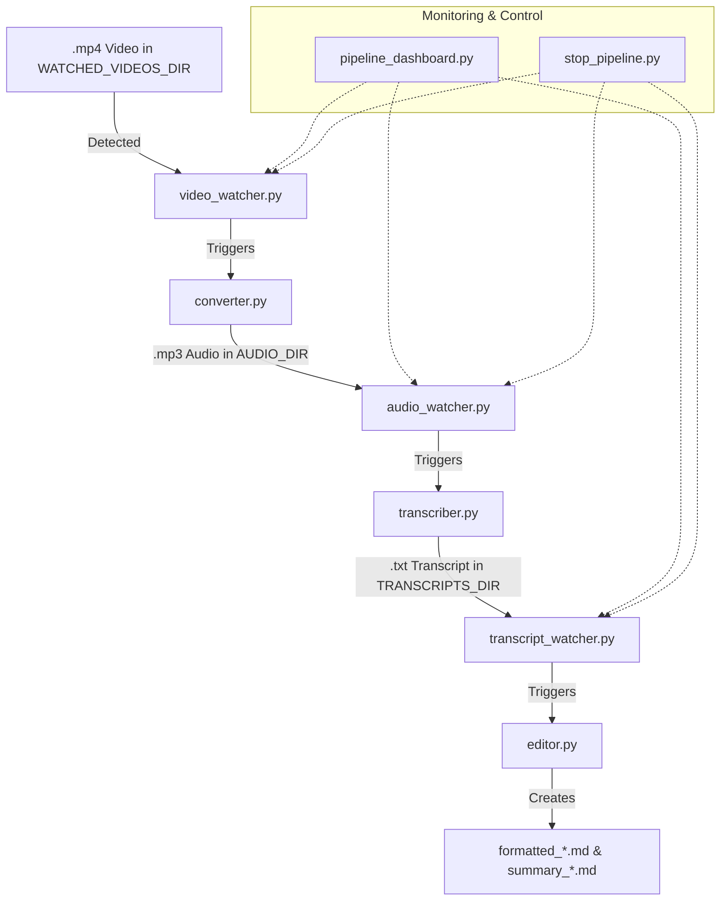

# Notes Generator

This project automates the process of generating well-structured and summarized markdown notes from video files using Python scripts, ffmpeg, OpenAI Whisper, and Gemini API.

## Pipeline Diagram



## Automated Pipeline Overview

1. **Drop a video file** (`.mp4`) into the configured `WATCHED_VIDEOS_DIR` (see `config.py`).
2. **video_watcher.py** detects the new video and triggers `converter.py` to extract audio as `.mp3`.
3. **converter.py** saves the audio file in the configured `AUDIO_DIR`.
4. **audio_watcher.py** detects the new `.mp3` and triggers `transcriber.py` to transcribe it using Whisper CLI.
5. **transcriber.py** saves the raw transcript as a `.txt` file in the configured `TRANSCRIPTS_DIR`.
6. **transcript_watcher.py** detects the new transcript and triggers `editor.py`.
7. **editor.py** uses Gemini API to:
   - Format the transcript into a well-structured markdown file (`formatted_...md`).
   - Generate a summary markdown file (`summary_...md`) with key ideas and action items.

All watcher scripts can be started and monitored using the provided PowerShell script and TUI dashboard:

### `run_pipeline.ps1` and `pipeline_dashboard.py`
- `run_pipeline.ps1` activates your Python virtual environment, starts all watcher scripts, and logs output/errors to the `logs/` directory.
- `pipeline_dashboard.py` provides a live TUI dashboard to monitor watcher status, logs, and to stop the pipeline cleanly.

## Folder Structure

```
notes_generator/
  scripts/
    video_watcher.py
    converter.py
    audio_watcher.py
    transcriber.py
    transcript_watcher.py
    editor.py
    gemini_api.py
    config.py
    stop_pipeline.py
    pipeline_dashboard.py
  logs/                     # Folder for watcher logs (auto-created)
  run_pipeline.ps1          # Script to launch the full pipeline
```

## Requirements

- Python 3.8+
- ffmpeg (must be installed and in your PATH)
- ffmpeg-python (`pip install ffmpeg-python`)
- OpenAI Whisper CLI (`pip install openai-whisper`)
- google-generativeai (`pip install google-generativeai`)
- Gemini API key (set as `GOOGLE_API_KEY` environment variable)
- rich (`pip install rich`) for the dashboard
- psutil (`pip install psutil`) for process management
- setproctitle (`pip install setproctitle`) for process naming

## Usage

1. Place your `.mp4` video files in the folder specified by `WATCHED_VIDEOS_DIR` in `config.py`.
2. Run `run_pipeline.ps1` from your project root in PowerShell:
   ```powershell
   .\run_pipeline.ps1
   ```
3. Optionally, run the dashboard for live monitoring:
   ```powershell
   python scripts/pipeline_dashboard.py
   ```
4. All watcher scripts will run in the background, and logs will be saved in the `logs/` folder.
5. Find your generated formatted and summary markdown notes in the `TRANSCRIPTS_DIR` (see `config.py`).

## Stopping the Pipeline
- Press `q` in the dashboard, or run `python scripts/stop_pipeline.py` to stop all watcher processes cleanly and print their final log messages.

## Customization

- **Centralized configuration:**
  - Update all folder paths and settings in `scripts/config.py` to match your system. All scripts use these values automatically.
- Change the Whisper model in `transcriber.py` for higher accuracy (e.g., `base`, `small`, `medium`, `large`).
- Update prompts in `config.py` for different formatting or summarization styles.

---
This project is modular, fully automated, and easy to extend for other automation or note-taking workflows.
